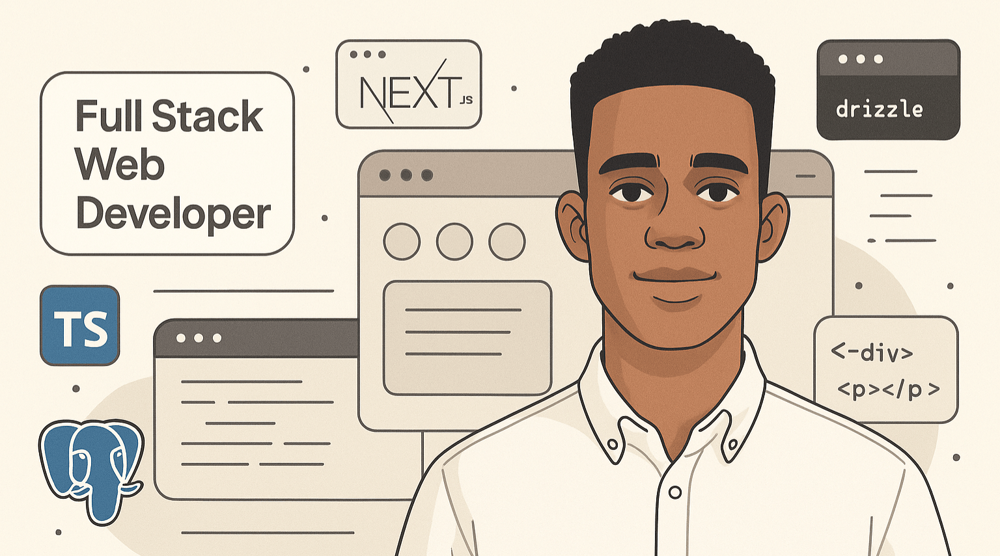

# 👋 Hi, I'm Ahmed. – Full-Stack Developer

I'm a passionate and detail-oriented full-stack web developer dedicated to crafting elegant, scalable, and high-performance web applications. I specialize in modern web technologies with a strong focus on clean architecture, developer experience (DX), and solving meaningful, real-world problems through thoughtful engineering.

My approach blends technical excellence with product thinking — I enjoy designing robust backend systems, building intuitive user interfaces, and streamlining the development process with scalable, maintainable code. Whether I’m working on a startup MVP, a multi-tenant SaaS platform, or internal tooling, my goal is always to deliver clean, reliable solutions that create value for both users and teams.

